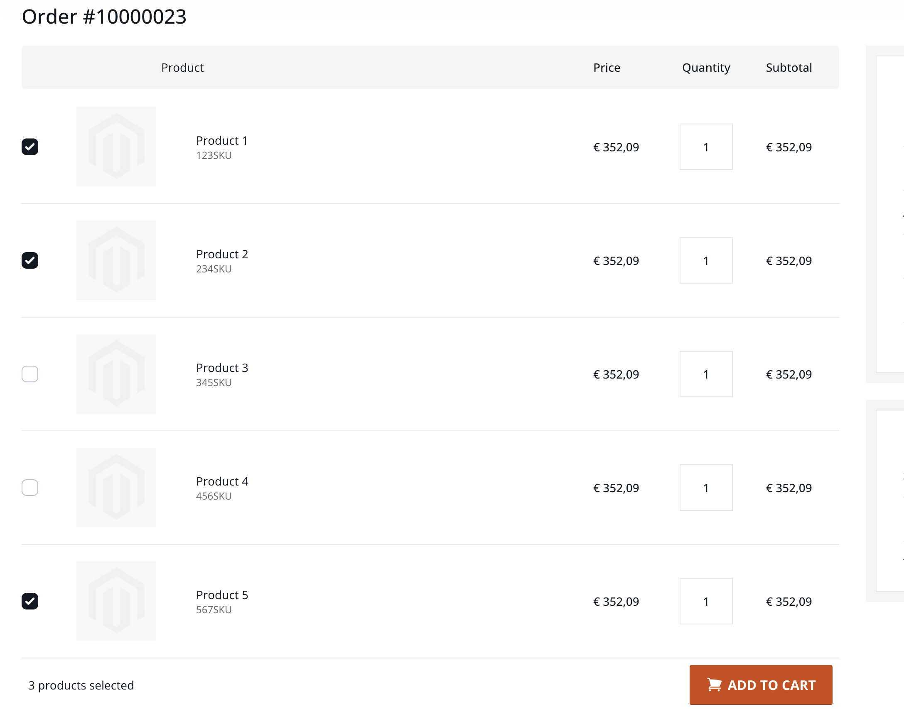

# Rapidez custom reorder

This package allows you to replace the standard Rapidez re-order functionality with a custom variant. This custom variant allows individual products to be selected, and also allows orders to be re-ordered that come from a different store (so long as the SKUs match up).



Note that this will require some manual work, see [usage](#usage).

## Installation

```
composer require rapidez/custom-reorder
```

## Configuration

You can publish the config with:
```
php artisan vendor:publish --tag=rapidez-custom-reorder-config
```

## Usage

> [!IMPORTANT]
> You will need to make sure that the `SKU` field can be filtered by. This means that `Visible in Advanced Search` needs to be enabled on this attribute.

This package will not work out of the box, however it contains a few blade components that will help make it easy. To set up this package you should do the following:

- Wrap the `x-rapidez-reorder::reorderable` component around your products table with a `v-bind:items` containing your items. If you're not using the standard magento order data, ideally the items should be in the same format as [OrderItem in the GraphQL API](https://developer.adobe.com/commerce/webapi/graphql-api/index.html#definition-OrderItem), or in the same format as [CartItemInput](https://developer.adobe.com/commerce/webapi/graphql-api/index.html#definition-CartItemInput) (in this case you should add the `cart-items` prop). If you can't or won't add the `entered_options` and `selected_options`, any configurable items will be grayed out.

- Then, wrap every individual item in your list with `x-rapidez-reorder::item` to allow the checkboxes and transparency to appear. Be aware that this wraps a `label` element around your item, which [may be impactful for any other interactive elements like anchor tags](https://developer.mozilla.org/en-US/docs/Web/HTML/Reference/Elements/label#accessibility). This should end up looking something like this (NOTE: you need to add the `index` to your loop if you don't have it already):
```blade
    <x-rapidez-reorder::reorderable v-bind:items="order.items">
        <ul>
            <li v-for="item, index in order.items">
                <x-rapidez-reorder::item>
                    [...]
                </x-rapidez-reorder::item>
            </li>
        </ul>
    </x-rapidez-reorder::reorderable>
```

- Optionally, you can show why certain items are grayed out using the `x-rapidez-reorder::availability` component. You can place this anywhere in the list of items, but our recommendation would be to place this below the product options and/or the SKU.

- Finally, you need to add the `x-rapidez-reorder::button.add-to-cart` component at the very bottom of the `reorderable` component. You can use `reorderSlotScope.added` as a Vue variable to determine what text your button should show. Note that this component is sticky by default, so adjust your frontend accordingly if needed. For example:
```blade
        [...]
        <x-rapidez-reorder::button.add-to-cart>
            <template v-if="reorderSlotScope.added">@lang('Added')</template>
            <template v-else>@lang('Add to cart')</template>
        </x-rapidez-reorder::button.add-to-cart>
    </x-rapidez-reorder::reorderable>
```

And that's it!

## Notes

- We don't currently have support for adding products to cart with custom options or configurations when using OrderItem-like data, as this requires directly matching labels. We're looking for a clean solution.

## License

GNU General Public License v3. Please see [License File](LICENSE) for more information.
